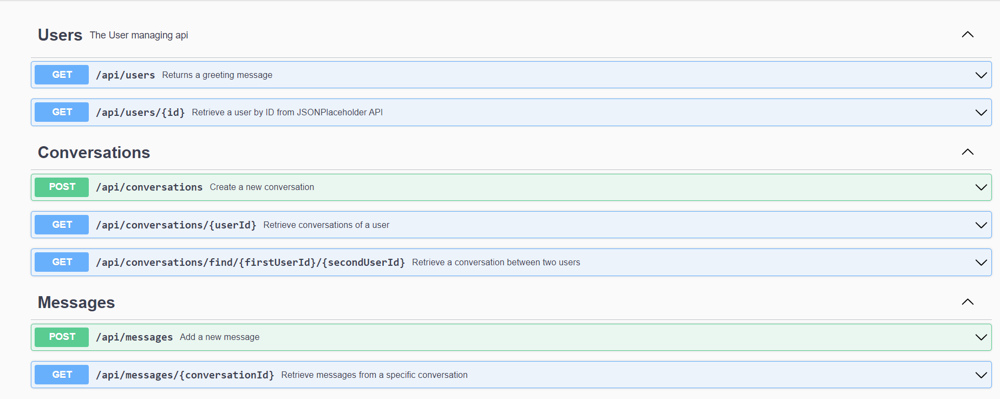

API Documentation


# Chat Application Microservice

This is a real-time chat application that is built with Node.js. The application provides several API endpoints for managing users, conversations, and messages.

## API Base URL

The base URL for the API is [http://localhost:3000](http://localhost:3000)

## API Endpoints

### Users API

- **GET /api/users** \
  Returns a greeting message \
  Response: string (200 OK)

- **GET /api/users/{id}** \
  Retrieve a user by ID \
  Parameters: User ID (in path) \
  Response: User object (200 OK), Internal server error (500)

### Conversations API

- **POST /api/conversations** \
  Create a new conversation \
  Request: Conversation object \
  Response: Conversation object (201 Created), Internal server error (500)

- **GET /api/conversations/{userId}** \
  Retrieve conversations of a user \
  Parameters: User ID (in path) \
  Response: Array of Conversation objects (200 OK), Internal server error (500)

- **GET /api/conversations/find/{firstUserId}/{secondUserId}** \
  Retrieve a conversation between two users \
  Parameters: First user ID, Second user ID (in path) \
  Response: Conversation object (200 OK), Internal server error (500)

### Messages API

- **POST /api/messages** \
  Add a new message \
  Request: Message object \
  Response: Message object (200 OK), Internal server error (500)

- **GET /api/messages/{conversationId}** \
  Retrieve messages from a specific conversation \
  Parameters: Conversation ID (in path) \
  Response: Array of Message objects (200 OK), Internal server error (500)

## Data Models

### Conversation Model

A Conversation consists of an array of user IDs participating in the conversation.

````json
{
  "users": [
    {
      "senderId": "6076f7047e8466001570e7d9"
    },
    {
      "receiverId": "6076f7047e8466001570e7da"
    }
  ]
}

### Message Model

A Message is associated with a specific conversation, and it contains the sender's user ID and the message text.

```json
{
  "conversationId": "6076f7047e8466001570e7d8",
  "sender": "6076f7047e8466001570e7d9",
  "text": "Hello, how are you?"
}

````
